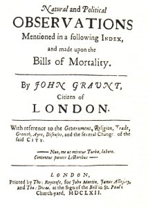
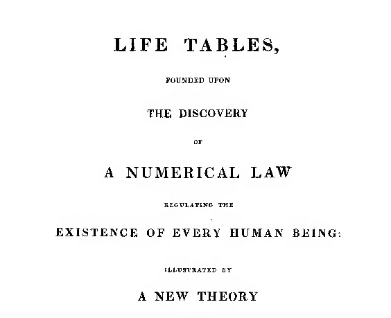

## Outline

1. Some review and history
2. Counting process notation and terminology
3. Representation of different nonparametric estimators
4. Censoring

# Review

## What is the outcome? 

Research interest is on the length of time elapsing between two events.

For example, time from birth to death, surgery to recovery, entry into the study to first diagnosis of cancer. 

The analysis of the time elapsing between two events is often referred to as survival analysis, failure time analysis, time to event analysis, or event history analysis. 

Feature of this outcome variable is that its observations may be censored (more on this later). 

It applies to experimental and observational data.

## Miniature example of survival data

Let $T$ denote a random variable representing time to death. $T > 0$. Let's pick a sample of n=10 survival times expressed in days

```{r}
set.seed(330)
t.samp <- c(2,    4,   14,   21 ,  24  , 27,   33,   51  , 60,   72)  
cat("t = ", sort(t.samp))
```

What is the probability of dying within a certain time $t$? 


## Introduction



---




## Statistics that we know and love

- Survival probability $S(t) = P(T > t) = 1 - F(t)$, where $F(t)$ is the cumulative distribution function
- If it exists $f(t)$ is the density function so that $S(t) = \int_t^\infty f(s) ds$. 
- The hazard function, defined as
\[
\alpha(t) = \lim_{dt \rightarrow 0} \frac{P(t \leq T < t + dt | T \geq t)}{dt}, 
\]
is equal to $f(t) / S(t)$.
- The cumulative hazard is $A(t) = \int_0^t\alpha(t) \,dt$ and $\exp(-A(t)) = S(t)$.

## Most-cited statistics papers

The two most cited statistical papers are:

1. Kaplan, E. L. & Meier, P. J. _Nonparametric estimation from incomplete observations_, J Am. Stat. Assoc. 53, 457–481 (1958).

with about 45,000 citations. It is a 1958 publication by US statisticians Edward Kaplan and Paul Meier that helps researchers to find survival patterns for a population, such as participants in clinical trials. That introduced what is now known as the Kaplan–Meier (KM) estimate. 

## Number 2

2. Cox, D. R. _Regression models and life tables_, J. R. Stat. Soc. B 34, 187–220 (1972).

with about 40,000 citations. It was the British statistician David Cox’s 1972 paper that expanded these survival analyses to regression.

Cox died in 2022 at age 97. If you haven't already, I highly recommend reading this 1972 paper. Also his interview with Nancy Reid is an interesting account of his life and work (both posted on course webpage).

Kaplan-Meier curves and Cox regression models are the statistical methods commonly used to analyze survival data.


## History

- Analysis of survival data has been going on for a long time
- Up until the mid 1970s, analysis of the estimators used classical (KM), empirical process (Breslow, et al.), or less rigorous theory/intuition (Cox)
- After that, Odd Aalen, the Norweigans, Danes, and the Berkley statisticians introduced _martingale theory_ into the analysis of these estimators
- Martingale theory is much older and comes from French mathematicians who studied games of chance

## Where we are going

Much of statistics is about studying estimation error, i.e., 
\[
\hat{\theta} - \theta.
\]

We will study estimation error of functions and processes relevant for the analysis of time-to-event data, i.e., 
\[
\hat{F}(t) - F(t), t \geq 0.
\]
or 
\[
\int_0^s H \,d\hat{F}_n - \int_0^s H\, dF
\]
Martingales are mathematical tools for studying such things and to use those tools, we need to view our estimators from that point of view. 

# Notation and terminology

## Counting processes

$\{N(t):  t \geq 0\}$, $N(t) \in \{0, 1, \ldots\}$ counts the number of events that occurred up to $t$. 

- The increment $N(t) - N(s)$ counts the number of events in the interval $(s,t]$ for $s < t$. 
- Jumps are of height 1
- Discrete time: $t \in \mathcal{T} = \{0, 1, \ldots\}$
- Continuous time: $t \in \mathcal{T} = [0, \infty] = \mathbb{R}^+$

## In general

A process $X$ is a family of random variables $\{X(t): t \in \mathcal{T}\}$ indexed by the set $\mathcal{T}$ all defined on the same probability space. $\mathcal{T}$ will always represent time, and hence will be the positive real line $\mathbb{R}^+$, or the positive integers. 

Unlike random variables which map from the sample space $\Omega$ to the real line, stochastic processes are mappings from $\mathcal{T} \times \Omega$ to the real line. For a fixed $\omega \in \Omega$, $X(\cdot, \omega)$ is a random function called a _sample path_ or _trajectory_. 

This added complexity requires some new notions and redefinitions for things including integration, conditional expectation that we will cover now and introduce as needed later on. 

Note that we will almost always suppress the dependence of $X$ on values in $\Omega$.

## The history of a process

It is often of interest to look at expectations of the future of a process conditional on the past. In discrete time, we can write
\[
E(X(t + 1) | X(0) = x_0, \ldots, X(t) = x_t).
\]
In continuous time, it may be tempting to write something similar. However, the sample paths are not exactly "events" that we can condition on, and hence we introduce the notion of a _history_ of a process. 

For a process $X(t)$, let $\mathcal{F}_t$ denote the smallest $\sigma$-algebra that makes all of the $X(s), 0 \leq s \leq t$ measurable (i.e., random variables). The sequence of $\sigma$-algebras $\{\mathcal{F}_t: t \geq 0\}$ such that $\mathcal{F}_s \subset \mathcal{F}_t$ for $s \leq t$ is the _history_ of a process $X(t)$ up to $t$

The $\sigma$-algebra is the formalization of the set of all possible events in that can be described by the process $X(t)$. We may also allow this history to include auxiliary information, like covariates.

__Recall__: a $\sigma$-algebra is a set that is closed under complement and countable unions.

## More on histories

$\mathcal{F}_n$ represents the information contained in $X(t): t \leq n$ and we will write $\mathcal{F}_{n-}$ to represent the information contained in $X(t): t < n$ (up to just before $n$). 

Note that $\mathcal{F}_1 \subset \mathcal{F}_2 \subset \cdots \subset \mathcal{F}_n$, i.e., the information increases over time (why?). The family of nested sub-$\sigma$ algebras $\{\mathcal{F}_t\}$ is called a _filtration_. 

We will write $X(t) \in \mathcal{F}_t$ if $X(t)$ is measurable with respect to $\mathcal{F}_t$ (i.e., $X(t)$ is a random function), and $X$ is _adapted_ to the filtration $\{\mathcal{F}_t\}$ if $X(t) \in \mathcal{F}_t$ for all $t$. 


## Stopped processes 

Let $X(t)$ be a process with history $\mathcal{F}_t$ and $T$ be a positive integer valued random variable. 

$T$ is a _stopping time_ if for all $t$ the event $\{T \leq t\} \in \mathcal{F}_t$. The _stopped process_ is 
\[
X^T = X(t \wedge T) = X(t) \mbox{ if } t \leq T \mbox{ and } X_T \mbox{ if } t > T. 
\]

If $T$ is the time that an event occurs, then it is a stopping time if the information in $\mathcal{F}_t$ specifies whether the event has occurred by time $t$. 

## Integrals

If $N(t)$ is a counting process and $f$ is some function of time (possibly random), then $\int_s^t f(u) \, dN(u)$ or just $\int_s^t f \, dN$ is the sum of the values of $f$ evaluated at the jump times of $N$ over the interval $(s, t]$. 

In general, if $Y$ is a right continuous process and $X$ a real valued function then the properties of $\int_s^t X \, dY$ follow from properties of integrals with respect to nondecreasing functions. 

In particular $\int_s^tX \, dY$ will a random variable, and hence $\{\int_s^tX \, dY: s \leq t < \infty\}$ is a stochastic process with index $[s, \infty)$. 


Usually $s = 0$ and we will denote $\int X\, dY$ to denote the process whose value at time $t$ is $\int_0^tX\, dY$. 


## Conditional expectation

The _conditional expectation_ $E(Y | \mathcal{F}_s)$ is the expectation of $Y$ given the history up to $s$ and is defined as follows: suppose $Y$ is a stochastic process with probability measure $P$ and history $\mathcal{F}_t$. Let $s < t$ so that $\mathcal{F}_s \subset \mathcal{F}_t$. If $X \in \mathcal{F}_s$ and 
\[
\int_B Y \, dP = \int_B X \, dP
\]
for all sets $B \in \mathcal{F}_s$, then $X$ is the conditional expectation of $Y$ given $\mathcal{F}_s$ and is denoted as above. It has the following useful properties

- For an event $A \in \mathcal{F}_n$, $P(A | \mathcal{F}_n) = E(I_A | \mathcal{F}_n)$.
- $E(Y | \mathcal{F}_n) \in \mathcal{F}_n$
- For any $Z \in \mathcal{F}_n$, $E(Z E(Y | \mathcal{F}_n)) = E(ZY)$ (iterated expectation formula)
- $E(aX + bY | \mathcal{F}_n) = aE(X | \mathcal{F}_n) + b E(Y |\mathcal{F}_n)$
- If $g$ is a convex, real-valued function, then $E(g(Y) | \mathcal{F}_n) \geq g(E(Y | \mathcal{F}_n))$ (Jensen's inequality)

## Intensity and at-risk process

Let $N(t)$ denote the counting process with history $\mathcal{F}_t$. The _intensity process_ is defined as 
\[
\lambda(t) = \frac{P(dN(t) = 1 | \mathcal{F}_{t-})}{dt},
\]
and represents the rate of events at time $t$ given the past. Given the definition of the hazard, we can write $\lambda(t) = \alpha(t) (1 - N(t-))$ or $= \alpha(t) I\{T \geq t\}$ if $T$ is the event time. 

Define $Y(t) = (1 - N(t-))$ to be the _at-risk_ process, the indicator that a failure has not yet occurred by time $t$.

The cumulative intensity process is $\Lambda(t) = \int_0^t\lambda(s) \, ds$.

_Note_: Fleming and Harrington use $\lambda$ and $\Lambda$ to denote the hazard/cumulative hazard. We are following the notation of ABG. 

## Aggregated counting process

Suppose $T_1, \ldots, T_n$ are independent non-negative random variables representing failure times (no censoring). 

The aggregated counting process $N(t) = \sum_{i = 1}^n N_i(t)$ counts the number of events that occur by time $t$, and likewise for $Y(t)$.

Assume there are no ties. If $\alpha_i(t) = \alpha(t)$ then we have $N(t)$ is a counting process with intensity 
\[
\lambda(t) = \alpha(t) Y(t), 
\]
where $Y(t) = \sum_{i = 1}^n Y_i(t)$. This is called the _multiplicative intensity process_. 


### Survival estimator without censoring

The _empirical survivor function_ is $\hat{S}(t) = n^{-1} (n - N(t))$. 

```{r}
Shat <- function(t) {
  sapply(t, function(tt) (length(t.samp) - sum(t.samp <= tt)) / length(t.samp))
}

xx <- seq(0, 75, by = 1)
plot(Shat(xx) ~ xx, type = "s")
abline(v = t.samp, col = "grey75")
lines(Shat(xx) ~ xx, type = "s")

```


## Censoring and the at-risk process

### The usual definition

Let $T_1, \ldots, T_n$ be potential lifetimes and for each $i$ we observe either $T_i$ or $C_i < T_i$, where $C_i$ is the censoring time. The observed data are $(\tilde{T}_i, D_i)$, where $D_i = 1$ if $T_i = \tilde{T}_i$ and $D_i = 0$ if $\tilde{T}_i = C_i$, in which case we know that $\tilde{T}_i < T_i$. 

### Counting process formulation

- $N_i(t) = I(\tilde{T}_i \leq t, D_i = 1)$, event process
- $Y_i(t) = I(\tilde{T}_i > t)$, the at-risk process
- Let $\mathcal{F}_t$ be the history of the multivariate process for all individuals $\{(N_i(s), Y_i(s)): s \leq t, i = 1, \ldots, n\}$

Recall that the goal is to infer something about $P(T_i > t | \mathcal{F}_t)$ and related quantities. Under what conditions can this be done based on the censored process $N(t)$?

## "Independent censoring" 

We will see next time that the following condition leads to some nice properties of our estimators: 
\[
P(t \leq \tilde{T}_i < t + dt, D_i = 1 | \tilde{T}_i \geq t, \mathcal{F}_{t-}) = P(t \leq T_i < t + dt | T_i \geq t).
\]

The right hand side is $\alpha_i(t) dt$ (hazard of the true times). The intensity of the observed process is 
\[
P(dN_i(t) = 1 | \mathcal{F}_{t-}) = \lambda_i(t) dt
\]
and under the above condition we have
\[
\lambda_i(t) dt = \alpha_i(t) dt Y_i(t).
\]
The condition is called "independent censoring", even though it is possible to construct event times and censoring times that are dependent, but where the condition holds. 


### Left truncation

If subjects enter the observation period at a certain time, there is _left truncation_. Then the observation for the $i$ subject is $(V_i, \tilde{T}_i, D_i)$ where $V_i$ is the entry time. 

With the at-risk process defined as $Y_i(t) = I\{V_i < t \leq \tilde{T}_i\}$ we have independent left truncation if the intensity process is as above. 


## Next steps

Under the independent censoring assumption, the process

\[
M(t) = N(t) - \int_0^t\lambda(t) \, dt
\]

is a mean zero _martingale_. A martingale is a process that has a random component and a _predictable_ component (analogous to the estimator and estimand/signal plus noise). 

Martingale theory, which was developed independently of survival analysis, gives us some tools to study the statistical properties of these estimators, with some slightly different notions of consistency and asymptotic normality. 

We will review these ideas and connect them to the estimators of interest in survival analysis, and see how the general theory applies. 


