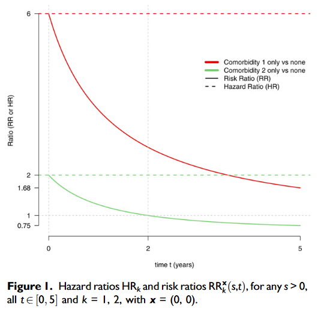

## Outline

1. Multiplicative models (Cox)
2. Inference
3. Extensions


## The traditional approach
Let $T$ denote the time to failure of interest, and $X$ some covariates (that are time fixed for now). 

The conditional hazard function is defined
\[
\alpha(t | X) = \lim_{h \rightarrow 0}\frac{1}{h}P(t \leq T < t + h | T \geq t, X).
\]
Suppose that for any two covariate values $X_1, X_2$, the associated conditional hazards have a fixed ratio, i.e., $\alpha(t | X_1) = k(X_1, X_2)\alpha(t | X_2)$ where $k$ is a nonnegative real valued function not depending on time. If $\alpha_0(t)$ denotes the baseline hazard (the hazard given $X = 0$), and $g(X) = k(X, 0)$, then 
\[
\alpha(t | X) = \alpha_0(t) g(X).
\]
$g$ is almost always taken to be $g(X) = \exp(X^\top \beta)$ for a vector of coefficients $\beta$. 

Alternatively, since $S(t | X) = \exp\{-\int_0^t\alpha(u | X) \, du\}$,
\[
S(t | X) = \{S_0(t)\}^{\exp(X^\top \beta)}.
\]

## Interpretation as logistic regression

For small values of $\Delta t$, we have
\[
\alpha(t | X) \Delta t \approx P(t \leq T < t + \Delta t | T \geq t, X). 
\]
If we define a partition $0 = t_0 < t_1 < \ldots < t_m < \ldots$ and 
\[
T^* = t_i \mbox{ if } t_i \leq T < t_{i+1}, i=0, 1, \ldots
\]
then the conditional hazard of $T^*$ is 
\[
\alpha^*(t_i | X) = P(T^* = t_i | T^* \geq t_i, X), i = 0, 1, \ldots
\]
which in terms of $T$ 
\[
\alpha^*(t_i | X) = 1 - \exp\left\{-\int_{t_i}^{t_{i+1}} \alpha(u | X) \, du\right\}.
\]
If we assume a proportional odds model and assume that the proportionality is the same over all partitions, then the linear logistic model for $T^*$ implies
\[
\frac{1 - \exp\left\{-\int_t^{t + \Delta t} \alpha(u | X) du\right\}}{\exp\left\{-\int_t^{t + \Delta t} \alpha(u | X) du\right\}} = \frac{1 - \exp\left\{-\int_t^{t + \Delta t} \alpha_0(u) du\right\}}{\exp\left\{-\int_t^{t + \Delta t} \alpha_0(u) du\right\}} \exp(X^\top \beta)
\]
which is equivalent to 
\[
\frac{1 - \exp\left\{-\int_t^{t + \Delta t} \alpha(u | X) du\right\}}{1- \exp\left\{-\int_t^{t + \Delta t} \alpha_0(u) du\right\}} = \frac{\exp\left\{-\int_t^{t + \Delta t} \alpha(u | X) du\right\}}{\exp\left\{-\int_t^{t + \Delta t} \alpha_0(u) du\right\}} \exp(X^\top \beta).
\]
Letting $\Delta t \rightarrow 0$ and using L'Hôpital's rule on the left side, we get the proportional hazards model.

## Censoring assumptions

The "independent censoring" assumption before was
\[
P(t \leq \tilde{T}_i < t + dt, D_i = 1 | \tilde{T}_i \geq t, \mathcal{F}_{t-}) = P(t \leq T_i < t + dt | T_i \geq t), 
\]
which if covariates are not time dependent, can be extended to our current situation as
\[
P(t \leq \tilde{T}_i < t + dt, D_i = 1 | \tilde{T}_i \geq t, \mathcal{F}_{t-}, X_i) = P(t \leq T_i < t + dt | T_i \geq t, X_i).
\]


## Counting process model -- set up

For a sample of size $n$, let $(\tilde{T}_i, \delta_i, X_i(t))$ denote the observed data, where $\tilde{T}_i = T_i \wedge U_i, \delta_i = I(\tilde{T}_i = T_i)$, where $U_i$ is the censoring time and $X_i(t)$ a $p$ dimensional vector of possibly time-dependent covariates. 

These data can be equivalently represented as $(N_i(t), Y_i(t), X_i(t))$ where $N_i(t) = I(\tilde{T}_i \leq t)$ is the event counting process and $Y_i(t) = I(\tilde{T}_i \geq t)$ is the at-risk process. We will use $N_\bullet(t) = \sum_{i = 1}^n N_i(t)$ and likewise for $Y_\bullet(t)$.

Define the right continuous filtration 
\[
\mathcal{F}_t = \sigma\{N(u), Y(u+), X(u+): 0 \leq u \leq t\}.
\]
Since $N$ is a counting process, Doob-Meyer applies and hence there is a unique predictable process $A$ such that $N - A$ is a martingale with respect to $\mathcal{F}_t$. 

If we assume $A(s) = \int_0^s \alpha_0(u)g(X(u))Y(u) \, du$, then we get a version of the multiplicative intensity model, where $\alpha_0$ is arbitrary and $g$ depends only on the covariates. 

Taking $g(X) = \exp(X^\top \beta)$ is a simple way to parameterize the model to get the effect of $X$ on the intensity while ensuring that the intensity is nonnegative. 


## Connection to the traditional approach

Let $N(t)$ be a counting process with compensator $A(t)$ with respect to a right continuous filtration $\mathcal{F}_t$. Assume that 
\[
A(t) = \int_0^t l(s) \, ds
\]
for some process $l$ that is left-continuous with right hand limits and is bounded by an integrable random variable. Then 
\[
\lim_{h \rightarrow 0}\frac{1}{h}E\{N(t + h) - N(t) | \mathcal{F}_t\} = l(t+).
\]
We will mainly concern ourselves with the case where 
\[
l(u) = \alpha_0(u)g(X(u))Y(u), 
\]
and 
\[
\mathcal{F}_t = \sigma\{N(u), Y(u+), X(u+): 0 \leq u \leq t\}.
\]

We have the decomposition $dN_i(t) = \lambda_i(t)dt + dM_i(t)$, and we will assume a model of the form
\[
\lambda_i(t) = Y_i(t) \alpha(t | X_i).
\]

## Notes on covariates

In order to use our counting process methods, we need to carefully consider the _history_ in this context. 

Recall the Doob-Meyer decomposition, in this context, says
\[
N_i(t) = \int_0^t Y_i(t)\alpha_0(t)r(\beta, X_i(t)) \, dt + M_i(t),
\]
where the first term is _predictable wrt to the history_ $\mathcal{F}_t$. Therefore, $X_i(t)$ must also be predictable wrt $\mathcal{F}_t$. 

One way to ensure this is to define the history to be the smallest $\sigma$ algebra generated by
\[
\{N_i(u), Y_i(u+), X_i(u+): 0 \leq u \leq t\},
\]
where $X_i(u+) = \lim_{s\downarrow u}X_i(s)$. 

In other words, the value of $X_i(t)$ must be known at $X_i(t-)$. Can you think of an applied situation where this holds, and another where this does not? 


## Counting process model -- notes

The only fundamental restriction on $A$ is that it is predictable wrt $\mathcal{F}_t$. Thus, this general model can accommodate

1. Recurrent events: $Y(t)$ can be 1 even after an event is observed

We have heuristically $E(dN(s) | \mathcal{F}_{s-}) = dA(s)$. 

2. Time dependent covariates: $X(t)$ must be predictable wrt $\mathcal{F}_t$!

We have a function
\[
\alpha(t | X(t)) = \lim_{h \rightarrow 0}h^{-1}P(t \leq T < t + h | T \geq t, X(t)),
\]
but this inherits none of the usual properties of a traditional hazard function. Hence there are some difficulties in interpreting this in terms of a conditional survival function $S(t | X(t))$. 

## Conditional likelihood? 

Cox 1972 took as the starting point 
\[
\alpha(t | X_i) = \alpha_0(t) \exp(\beta^\top X_i), 
\]
and defined 
\[
T_{(1)} < T_{(2)} < \cdots < T_{(k)}
\]
to be the ordered distinct observed event times, each with multiplicity $m_{(i)}$, and the _risk set_ process
\[
\mathcal{R}(t) = \{i: \tilde{T}_i(t) \geq t\} = \{i: Y_i(t) = 1\}.
\]
Cox writes "For a particular failure at time $T_{(i)}$, conditional on the risk set $\mathcal{R}(T_{(i)})$, the probability that the failure is on the individual as observed is 
\[
\frac{\exp(\beta^\top X_{(i)})}{\sum_{l \in \mathcal{R}(T_{(i)})} \exp(\beta^\top X_{(l)})}.
\]
Each failure contributes a factor of this nature and hence the required conditional" likelihood is obtained by taking the product of those factors. He then proceeds as though he were working with a regular likelihood involving independent terms that fully characterize the distribution. 

## Interpretation of the terms

"For a particular failure at time $T_{(i)}$, conditional on the risk set $\mathcal{R}(T_{(i)})$, the probability that the failure is on the individual as observed"

\begin{align*}
P(dN_i(t) = 1 | dN_\bullet(t) = 1, \mathcal{F}_{t-}) = \\
\frac{P(dN_i(t) = 1 | \mathcal{F}_{t-})}{P(dN_\bullet(t) = 1| \mathcal{F}_{t-})} = \frac{\lambda_i(t)}{\lambda_\bullet(t)} = \frac{Y_i(t)r(\beta, X_i)}{\sum_{j=1}^nY_j(t)r(\beta, X_j)} = \\
\frac{r(\beta, X_i)}{\sum_{j \in \mathcal{R}(T_{(i)})}r(\beta, X_j)}.
\end{align*}

Cox claimed that maximum likelihood estimation of $\beta$ and inference can proceed in the usual way. Is this adequate justification and why? 

## Partial likelhood justification

Cox attempted to more rigorously develop the idea in 1975 (Biometrika). Here is a sketch of the idea: 

- Suppose the observed data $\mathbf{X}$ has density $f(\mathbf{x}, \theta)$, where $\theta = (\beta, \phi)$. The primary target of inference is $\beta$, while $\phi$ is a nuisance parameter. 
- In Theory I, you learned about methods:
    + to jointly maximize the likelihood wrt $\theta$, and look at components of the covariance matrix for $\beta$
    + to condition on a sufficient statistic for $\phi$ and use the conditional distribution to make inference on $\beta$
- If $\phi$ is infinite dimensional, those don't work
- Instead, if $\mathbf{X} = (V, W)$ such that 
\[
f(\mathbf{x}, \theta) = f(w | v, \beta) f(v, \theta)
\]
then the first factor can be used alone to make inference on $\beta$. 

This also illustrates the _noninformative censoring_ assumption, i.e., that the likelihood components of the censoring time do not depend on $\beta$. 

## Partial likelihood issues

Cox derived such a decomposition in his 1975 paper. 

- It is still not a likelihood, so standard likelihood results don't apply directly, i.e., need to prove from scratch that the maximum wrt $\beta$, exists, is consistent, and asymptotically normal.
- The other component still depends on $\theta$, so we may expect some efficiency loss. 

Cox made some arguments along these lines for his 1972 model, and showed that the components of the partial likelihood are uncorrelated (but not independent). 

Jacod, in a series of papers in the 1980s, generalized these arguments and provided formulas for likelihood ratios and partial likelihoods for counting processes, then explored their martingale properties. Details are in ABGK, chapter II.

The Cox partial likelihood can also be derived as a _marginal_ likelihood, i.e., the likelihood of the ranks of the event times, marginalizing out the distributions of the times. See Fleming and Harrington page 140. 


## Martingale representation

The likelihood process is 
\[
L(\beta, t) = \prod_{i = 1}^n\prod_{0 \leq u \leq t} \left\{\frac{Y_i(u)\exp(\beta^\top X_i(u))}{\sum_{j = 1}^nY_j(u)\exp(\beta^\top X_j(u))}\right\}^{dN_i(u)}.
\]
Taking the log we get
\[
\log L(\beta, t) = l(\beta, t) = \sum_{i = 1}^n\int_0^t\left\{\beta^\top X_i(u) - \log \sum_{j = 1}^nY_j(t) \exp(\beta^\top X_j(t))\right\}\, dN_i(u). 
\]
Now let
\[
S^{(0)}(\beta, t) = \sum_{j = 1}^nY_j(t) \exp(\beta^\top X_j(t)),
\]
and 
\[
S^{(1)}(\beta, t) = \sum_{j = 1}^nY_j(t) X_j(t) \exp(\beta^\top X_j(t)).
\]

## The score process

Taking the derivative of $l(\beta, t)$ wrt $\beta$, we get (exercise)
\[
U(\beta, t) = \frac{\partial}{\partial \beta} l(\beta, t) = \sum_{i = 1}^n\int_0^t\left\{X_i(u) - \frac{S^{(1)}(\beta, u)}{S^{(0)}(\beta, u)} \right\}\, dN_i(u) = \sum_{i = 1}^n U_i(\beta, t).
\]
Recalling that $dN_i(u) = Y_i(u)\alpha_0(u)\exp(\beta^\top X_i(u)) \, du + M_i(u)$, we now have 
\[
U(\beta, t) = \sum_{i = 1}^n\int_0^t\left\{X_i(u) - \frac{S^{(1)}(\beta, u)}{S^{(0)}(\beta, u)} \right\}\, dM_i(u),
\]
where $M_i(u) = N_i(t) - \int_0^tY_i(u)\alpha_0(u)\exp(\beta^\top X_i(u)) \, du$. 

This has the familiar form $\sum_i \int H_i \, dM_i$, and when the model is true, $E(U(\beta, t)) = 0$ for all $t$.

It can also be shown that for $k = 1, \ldots, p$ and $i \neq j$, 
\[
E(U_i(\beta, t)_k U_j(\beta, t)_k) = 0.
\]
So that the score is a sum of uncorrelated terms. 

## Information matrix

Taking derivatives again, note that 
\[
S^{(2)}(\beta, t) = \sum_{j = 1}^nY_j(t) X_j(t)^{\otimes 2} \exp(\beta^\top X_j(t)),
\]
where $x^{\otimes 2} = x x^\top$ (outer product). It can be shown that
\[
I(\beta, t) = -\frac{\partial}{\partial \beta} U(\beta, t) = \int_0^tV(\beta, t) \, dN(u), 
\]
where 
\[
V(\beta, t) = \frac{S^{(2)}(\beta, t)}{S^{(0)}(\beta, t)} - \left(\frac{S^{(1)}(\beta, t)}{S^{(0)}(\beta, t)}\right)^{\otimes 2}.
\]
It can also be shown that 
\[
\langle U(\beta) \rangle (t) = \int_0^tV(\beta, u) S^{(0)}(\beta, u) \alpha_0(u) \, du.
\]
Now, since $N(t)$ has intensity process $S^{(0)}(\beta, t) \alpha_0(t)$, we know that
\[
\int_0^tV(\beta, t) \, dN(u) = \int_0^tV(\beta, u) S^{(0)}(\beta, u) \alpha_0(u) \, du + \mbox{a martingale}. 
\]
By uniqueness of the Doob-Meyer decomposition, this proves that 
\[
I(\beta, t) = \langle U(\beta) \rangle (t) + \int_0^tV(\beta, u) \, dM(u), 
\]
and hence, the expected information matrix equals the covariance matrix of the score equations. 

## Asymptotic result

If we assume that 
\[
\frac{1}{n}\int_0^tV(\beta, u) S^{(0)}(\beta, u) \alpha_0(u) \, du \rightarrow_p \sigma^2(t),
\]
as $n\rightarrow \infty$, then the (multivariate) martingale central limit theorem applies. Thus we get
\[
\frac{1}{\sqrt{n}}U(\beta,t) \Rightarrow Z(t)
\]
in $D[0, \tau]^p$ where $Z(t)$ is a $p$ variate Gaussian process with covariance function defined by the limiting process above. 

Hence for a fixed $t$, say $\infty$ or the maximum follow up time, $n^{-1}U(\beta)$ is asymptotically multivariate normal with covariance matrix $\Sigma$ that is also the limiting value of $n^{-1}I(\beta)$. 

If $\hat{\beta}$ is the solution to $U(\hat{\beta}) = 0$, then 
\[
U(\hat{\beta}) \approx U(\beta) - I(\beta)(\hat{\beta} - \beta),
\]
and the usual arguments apply to conclude that 
\[
\sqrt{n}(\hat{\beta} - \beta) \rightarrow_d N(0, \Sigma^{-1})
\]
and the covariance matrix can be estimated by $I(\hat{\beta})^{-1}$.


## Stratified Cox model

Instead of assuming a common baseline hazard, one can assume that the hazard is 
\[
\alpha(t | x) = \alpha_{s0}(t)\exp(\beta^\top x(t))
\]
for $s = 1, \ldots, k$, where the population is grouped into $k$ strata. The grouping of strata can also depend on time (example later). 

The partial likelihood is then 
\[
\prod_{s = 1}^k\prod_{T_{sj}}\frac{\exp(\beta^\top X_{i_j}(T_{sj}))}{\sum_{l \in \mathcal{R}_{sj}} \exp(\beta^\top X_l(T_{sj}))}
\]
where the event times and risk sets are defined within strata. The statistical properties are the same. 

```{r}

```

## Handling Ties

The definition of the partial likelihood works out for continuous time, such that only one individual experiences an event at each observed event time. If that is not the case, the _risk set_ when there are ties is problematic. What to do with the subject who experienced an event at the same time as the current likelihood contribution? 

1. The Breslow method basically ignores ties. Two people die at the same time, they both have a contribution, and each one is in the risk set for the other one. 
2. The Efron approximation views the observed times as coarsened versions of truely continuous times. In that case, there are two possible risk sets, but we don't know which one is correct. The solution is to take the average of the two as the denominator. 
3. The exact method computes an exact likelihood, based on the logistic model in discrete time. It is computationally complex.

## Breslow estimator

$N(t)$ has intensity process $S^{(0)}(\beta, t) \alpha_0(t) = \sum_{j = 1}^nY_j(t) \exp(\beta^\top X_j(t))$. Breslow, in a short comment on Cox's 1972 paper, noted that the expression
\[
\hat{A}_0(t) = \int_0^t \frac{dN(u)}{\sum_{j = 1}^nY_j(t) \exp(\beta^\top X_j(t))}
\]
coincides with the Nelson-Aalen estimator when $\beta = 0$. Hence the plug-in estimator
\[
\int_0^t \frac{dN(u)}{\sum_{j = 1}^nY_j(t) \exp(\hat{\beta}^\top X_j(t))}
\]
is an estimator of the cumulative baseline hazard $A_0(t) = \int_0^t\alpha_0(u) \, du.$

For a fixed covariate path $x_0(s)$, the cumulative hazard under our model is 
\[
A(t | x_0) = \int_0^t\exp(\beta^\top x_0(u)) \alpha_0(u)\, du = \int_0^t\exp(\beta^\top x_0(u)) \, d A_0(u). 
\]
So, plugging in our plug-in estimator, we can estimate this with 
\[
\hat{A}(t | x_0) = \int_0^t\exp(\hat{\beta}^\top x_0(u)) \, d \hat{A}_0(u) = \sum_{T_j < t}\frac{\exp(\hat{\beta}^\top x_0(T_j))}{\sum_{l \in \mathcal{R}(T_j)}\exp(\hat{\beta}^\top x_0(T_l))}.
\]
Finally, using the relationships between the cumulative hazard and survival, we can estimate the survival curve given a fixed covariate path $x_0$ as
\[
\hat{S}(t | x_0) = \prod_u^t(1 - d\hat{A}(u | x_0))
\]
or 
\[
\hat{S}(t | x_0) = \exp(-\hat{A}(u | x_0)).
\]
Asymptotic properties? 

## Large sample properties of Breslow estimator

Based on the decomposition, where $r(\beta, X) = \exp(\beta^\top X)$: 
\[
\hat{A}(t | x_0) - A(t | x_0) = \int_0^t r(\hat{\beta}, x_0(u))(d\hat{A}_0(u, \hat{\beta}) - d\hat{A}_0(u, \beta_0)) 
\]
\[
+ \int_0^t r(\hat{\beta}, x_0(u))(d\hat{A}_0(u, \beta_0) - \alpha_0(u) du)
\]
\[
+ \int_0^t (r(\hat{\beta}, x_0(u)) - r(\beta_0, x_0(u))) \alpha_0(u) \, du, 
\]
where 
\[
\hat{A}_0(t,\beta) = \int_0^t\frac{dN_\bullet(u)}{S^{(0)}(\beta, u)}. 
\]

Replacing $r(\hat{\beta}, x_0(u))$ with $r(\beta_0, x_0(u))$ in the first two terms, and doing a Taylor series expansion followed by some algebra yields quite a complicated expression. 

But in the end we can argue that the Breslow estimator for the cumulative hazard and the survival function are asymptotically Gaussian martingales. 

## Bootstrapping and confidence bands

Dobler, Pauly, and Scheike (2019), _Biometrics_, describe some bootstrap procedures to avoid using the complicated estimators for the variance. Let $G_1, \ldots, G_n$ be iid random variables with mean 0 and variance 1. Define: 

\[
U^*(t, \hat{\beta})  = \sum_{i = 1}^n G_i U_i(\hat{\beta}, t), 
\]
\[
I^*(t, \hat{\beta}) = \sum_{i = 1}^n G_i^2 I_i(\hat{\beta}, t),
\]
where $U_i$ are the score contributions, and $I_i$ are the information matrix contributions. Then we have the multiplier bootstrap samples
\[
\sqrt{n}(\hat{\beta}^* - \hat{\beta}) = \left\{n^{-1}I^*(t, \hat{\beta})\right\}^{-1}\frac{1}{\sqrt{n}}U^*(t, \hat{\beta})
\]
and an expression for $\sqrt{n}(\hat{A}^*_0(\cdot, \hat{\beta}^*) - \hat{A}^*_0(\cdot, \hat{\beta}^*))$ (equation 10) in the paper. 

They show that these quantities have the same asymptotic distribution as the original estimators.

Then we can find the quantile of the empirical bootstrap distribution to use as the critical value in the construction of confidence bands. 

Since the survival curve is a (Hadamard differentiable) functional of the cumulative hazard, we can apply the same functional to the bootstrap quantities. 


## Relationship to survival with time-dependent covariates

We have a function
\[
\alpha(t | X(t)) = \lim_{h \rightarrow 0}h^{-1}P(t \leq T < t + h | T \geq t, X(t)),
\]
but this inherits none of the usual properties of a traditional hazard function. Hence there are some difficulties in interpreting this in terms of a conditional survival function $S(t | X(t))$.

If we define $R(s, t | X(s)) = P(T \leq s + t | T > s, X(s))$, for $s, t > 0$ and covariate value $X(s)$, then the relative risk comparing any two covariate values at the same time $s$ does not necessarily correspond to the hazard ratio from a time-dependent Cox model. 

Blanche, Zareini and Rasmussen (2022) show what can go wrong here and highlight the difficulties of this interpretation. The problem is apparent when viewing this estimand in the context of a _multi-state model_, where one of the states is defined by the value of a time dependent covariate. 





## Martingale Residuals

Starting with the counting process martingale under the model
\[
M_i(t) = N_i(t) - \int_0^t Y_i(u) \exp(\beta^\top X_i(u)) \, dA_0(u),
\]
then plugging in the estimators $\hat{\beta}$ and $\hat{A}_0$, evaluating at the maximum follow up time $\tau$, we get the _martingale residuals_
\[
\hat{M}_i = N_i(\tau) - \int_0^\tau Y_i(u) \exp(\hat{\beta}^\top X_i(u)) \, d\hat{A}_0(u).
\]
These are not terribly useful on their own, but if they are associated with a covariate, then we can infer that the covariate (or a transformation of it) should be included in the model. 

Consider the model
\[
\alpha(t | X, Z) = \exp(h(X))\exp(\beta^\top Z)\alpha_0(t), 
\]
and we would like to infer the function $h$. If we fit the model omitting the covariate $X$ and calculate the martingale residuals $\hat{M}_i$, and compute
\[
E(\hat{M}_i | X) \approx (h(X) - \bar{h}) \cdot \mbox{constant},
\]
**if** $X$ and $Z$ are approximately independent. Details starting on page 165 of Fleming and Harrington


```{r, warning=FALSE, message = FALSE}
library(survival)
library(ggplot2)

fit1 <- coxph(Surv(futime, death) ~ sex, data = mgus)
res1 <- residuals(fit1, type = "martingale")

ggplot(data.frame(age = mgus$age, mresid = res1), aes(x = age, y = mresid)) + 
  geom_point() + stat_smooth()

```


## Schoenfeld residuals

\[
S_{ij} = (X_{ij} - \frac{S^{(1)}(\hat{\beta}, T_i)}{S^{(0)}(\hat{\beta}, T_i)}) D_i, j = 1, \ldots, p.
\]
This is the contribution to the score for each individual who experiences a failure, hence it compares the observed covariate value to its expected value under the model. 

This is used to assess departures from the proportional hazards assumption since a trend observed over the event times would indicate that $\beta$ should be time dependent.

```{r}
res2 <- residuals(fit1, type = "schoenfeld")
plot(cox.zph(fit1))
abline(h = 0)
```

> For Schoenfeld residuals, the returned object is a matrix with one row for each event and one column per variable. The rows are ordered by time within strata, and an attribute strata is attached that contains the number of observations in each strata. 


## Time varying coefficients

An extension of the Cox model 
\[
\alpha(t | X) = \alpha_0(t) \exp(\beta(t) X).
\]
While the Schoenfeld residuals can give you an indication of departures from proportional hazards, to summarize the nature of the time dependent relationship, the functional form of $\beta(t)$ needs to be prespecified. One option is to use a step function: 

```{r}
vfit <- coxph(Surv(time, status) ~ karno, data = veteran)
zp <- cox.zph(vfit, transform = function(time) log(time + 20))
zp
plot(zp, resid = FALSE)


## create a time dependent indicator of time under observation
vet2 <- survSplit(Surv(time, status) ~ ., data = veteran, 
                  cut = c(90, 180), episode = "tgroup", id = "id")
head(vet2)

vfit2 <- coxph(Surv(tstart, time, status) ~ karno:strata(tgroup), 
               data = vet2)
vfit2
zp2 <- cox.zph(vfit2, transform = function(time) log(time + 20))
zp2

plot(zp2, resid = FALSE)

## continuous time transformation

vfit3 <- coxph(Surv(time, status) ~ karno + tt(karno), 
               data = veteran, 
               tt = function(x, t, ...) x * log(t + 20))
vfit3

```


## Summary and alternatives to the Cox model

- Cox model led to some important theoretical developments
- It is broadly appealing due to its conceptual and computational simplicity
- The simplicity can also be a source of criticism

Next we will look at some alternatives, starting with the additive hazards model. 


