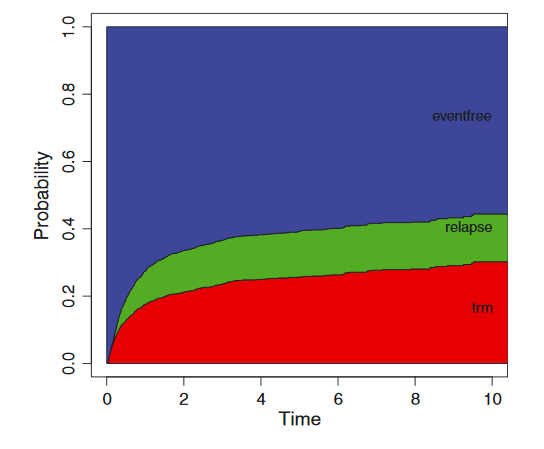
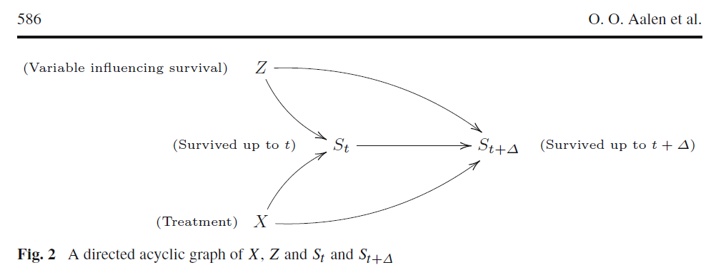

# Alternative summary measures

Once you have an estimate of $S(t) = P(T > t) = 1 - F(t)$, there are some other interesting summary measures of the distribution of the time to event

## Median survival 

Let $\xi_p$ denote the value that satisfies $F(\xi_p) = p$ for $p \in [0, 1]$. We can define $\hat{\xi}_p$ to be the smallest value $x$ for which $\hat{S}(x) \leq 1 - p$. 

The asymptotic distribution of $\hat{\xi}_p$ has a variance that depends on the density of $T$, which can be shown using the functional delta method for $\phi(F) = F^{-1}$. 

Instead, confidence limits for $\xi_p$ can be determined by applying the same functional to the confidence limits of the survival curve: 

```{r}
library(survival)
head(lung)

sfit <- survfit(Surv(time, status == 2) ~ 1, 
                data = lung)
plot(sfit)

xi.5 <- sfit$time[min(which(sfit$surv < .5))]
xi.5.low <- sfit$time[min(which(sfit$lower < .5))]
xi.5.hi <- sfit$time[min(which(sfit$upper < .5))]

segments(c(0, xi.5.low, xi.5, xi.5.hi), 
        c(.5, .5, .5, .5), 
        c(xi.5.hi, xi.5.low, xi.5, xi.5.hi), 
        c(0.5, 0, 0, 0), lty = 3)

unlist(median(Surv(lung$time, lung$status == 2)))
sprintf("%.0f (%.0f to %.0f)", xi.5, xi.5.low, xi.5.hi)

```

# Mean and restricted mean

The mean survival time is
\[
\mu = \int_0^\infty S(t) dt, 
\]
but the value depends on the right-hand tail of the distribution. With censoring, we don't have a good estimate of that right hand tail beyond the last observed event time. 

Instead, the _restricted mean_ is used: for a fixed $t$
\[
\mu_t = \int_0^tS(u) du
\]
and $\hat{\mu}_t$ is estimated by plugging in $\hat{S}$, i.e., the area under the survival curve.

Asymptotically, the restricted mean is approximately normal with variance that may be estimated by
\[
\sum_{T_j \leq t} \frac{(\hat{\mu}_t - \hat{\mu}_{T_j})^2}{Y(T_j)^2}.
\]

# Area under the cumulative incidence curve

Consider the competing risks setting, with $T_i$ the time to the first event, and $\delta_i$ the event indicator. 

If we denote $F_j(t) = P(T_i < t, \delta_i = j)$, and $S(t)$ the overall survival function, then due to the relationship
\[
S(t) + \sum_j F_j(t) = 1, 
\]
we have
\[
t^* - \int_0^{t^*}S(t) dt = \sum_j \int_0^{t^*}F_j(t) dt. 
\]
Hence for $t^*$ a fixed time we have
\[
\int_0^{t^*} P(T_i < u, \delta_i = k) \, du = E(t^* - \min\{T_i, t^*\})1\{\delta_i = k\}) 
\]
This is interpreted as the expected lifetime lost due to cause $k$ up to time $t^*$. 

# Figure

```{r}

```

See Andersen PK. Decomposition of number of life years lost according to causes of death. Statistics in medicine. 2013 Dec 30;32(30):5278-85.

# Recurrent events

Suppose $N_i(t)$ counts the number of observed events up to time $t$ for subject/cluster $i$, where there may be more than one event. This is usually subject to censoring, so we have the at risk process $Y_i(t)$ such that $N_i(t) = \int Y_i(s) d\tilde{N}_i(s)$ where $\tilde{N}_i$ is the fully observed counting process. 

We have an intensity process 
\[
E(dN_i(t) | \mathcal{F}_{t-}) = \lambda_i(t) dt
\]
such that $N_i = \int \lambda_i(s) \, ds + M_i$, $M_i$ a martingale. 

We can also have a _rate_ model or _marginal_ model
\[
r_i(t) dt = E(d\tilde{N}_i(t) | \mathcal{E}_{t-}), 
\]
where $\mathcal{E}_{t-}$ contains information on external covariates, but not internal covariates nor the history of the counting process (See ABG page 132). 

When conditioning on $\mathcal{E}_{t-}$, we do not get the Doob-Meyer decomposition, and to progress we must assume 
\[
E(dN_i(t) | Y_i(t), \mathcal{E}_{t-}) = Y_i(t) E(d\tilde{N}_i(t) | \mathcal{E}_{t-}), 
\]
which is stronger than the independent censoring assumption. 

# Nonparametric estimation

The Nelson-Aalen estimator for the cumulative hazard is defined
\[
\hat{A}(t) = \int_0^t \frac{dN(u)}{Y(s)},
\]
but with recurrent events, we have different possible ways of aggregating the processes. $N(t)$ will usually be the sum of the individual counting processes (i.e., total number of events), and if $Y(t)$ indicates for all observable processes, then we have an estimate of the _cumulative mean function_. 

See Ghosh D, Lin D (2000) Nonparametric analysis of recurrent events and death. Biometrics 56:554–562 for more details. 

# Example

In ABG, example 8.2, they consider 27 individuals observed sleeping for one night. The outcome is the number of awakenings during the night. They consider three ways of defining the at-risk process: 

1. $Y(t)$ is the number of people asleep just before time $t$
2. $Y_1(t)$ number asleep at $t$ who have had a larger than average number of awakenings before time $t$, and 
3. $Y_2(t)$ number asleep at $t$ who have had a smaller than average number of awakenings before time $t$. 

They note that $Y(t) =Y_1(t) + Y_2(t)$, and hence the three different cumulative mean functions can be estimated from the additive model for the rate: 

\[
r_i(t) = \beta_1(t)I_i(t) + \beta_2(t)(1 - I_i(t)), 
\]
where $I_i(t)$ is 1 if the number of awakenings is greater than the mean for all processes, and 0 otherwise. 

# Regression 

We can assume a relative model
\[
Y_i(t) \alpha_0(t)r(\beta, Z_i(t)), 
\]
where the key distinction is that the covariate processes $Z_i(t)$ may or may not contain information about the history of the counting processes. If it does, then the model is semi-Markov, and if not, then the model is Markov. 

Andersen and Gill (1982) showed that the Cox partial likelihood with recurrent events works, in the sense that maximizing it leads to consistent and asymptotically normal estimates of the coefficients. 

In the ABG book, they distinguish between these two cases as _marginal_ versus _dynamic_. 

Additive regression models also work in the same way, but in the book the discuss the problem of dynamic covariates leading to singularities in the hat matrix. 

# Example

```{r}
#library(survival)
head(cgd)


## nonparametric

cgdsurv <- survfit(Surv(tstart, tstop, status) ~ treat, cgd, id=id)
plot(cgdsurv, cumhaz=TRUE, col=1:2, conf.times=c(100, 200, 300, 400),
xlab="Days since randomization", ylab="Cumulative hazard")

## additive version
cdgsurv2 <- aareg(Surv(tstart, tstop, status) ~ treat, data = cgd)
plot(cumsum(cdgsurv2$coefficient[, 1]) ~ cdgsurv2$times, type = "s")
lines(cumsum(cdgsurv2$coefficient[, 1] + cdgsurv2$coefficient[, 2])~ 
        cdgsurv2$times, type = "s", col = "red")


## regression

#marginal model
coxph(Surv(tstart, tstop, status) ~ treat + sex + age, data = cgd, 
      id = id)

# dynamic model
cgd$event_past60 <- unlist(by(cgd, cgd$id, function(dat) {
  
  c(0, ((dat$tstop[-1] - dat$tstop[-length(dat$tstop)]) < 60 &
    dat$status[-length(dat$tstop)] == 1))
  
}) )
coxph(Surv(tstart, tstop, status) ~ treat + sex + age + event_past60, 
      data = cgd, 
      id = id)


```


# Pseudo observations
### Notation

Let $T_i$ denote the time to event, $\delta_i \in \{1, \ldots, d\}$
denote the indicator of the cause of the event for $d$ competing
causes, and $X_i$ a vector of covariates for subject $i = 1, \ldots, n$.  

For a fixed $t$, and for $V_i = 1\{T_i < t, \delta_i=k\}$, We would like to fit the model 

$$
g\{E(V_i | X_i)\} = g\{P(T_i < t, \delta_i = k | X_i)\} = \beta^\top X_i,
$$
for some link function $g$.

We do not observe $T_i$ and $\delta_i$ directly, but rather $Y_i = \min\{C_i, T_i\}$ where $C_i$ is the censoring time, and $\Delta_i \in \{0, 1, \ldots, d\}$ where where 0 indicates censoring occurred before any of the events.

# Other estimands

We will use $V_i$ to denote transformations of $(T_i, \delta_i)$ whose expectations represent summary statistics of interest. 

1. The cause specific cumulative incidence of cause $k$ at time $t^*$: $V_i = 1\{T_i < t^*, \delta_i = k\}$ and $E(V_i) = P(T_i < t^*, \delta_i = k)$.
2. In the case where $d = 1$, the cumulative incidence (one minus survival) at time $t^*$: $V_i = 1\{T_i < t^*\}$ and $E(V_i) = P(T_i < t^*)$.
3. The expected lifetime lost due to cause $k$ up to time $t^*$: $V_i = (t^* - \min\{T_i, t^*\})1\{\delta_i = k\}$ and $E(V_i) = \int_0^{t^*} P(T_i < u, \delta_i = k) \, du$.
4. In the case where $d = 1$, the restricted mean survival up to time $t^*$: $V_i = \min\{T_i, t^*\}$ and $E(V_i) = \int_0^{t^*} P(T_i > u) \, du.$
5. ...

Our main interest is in estimating the parameters of a generalized linear regression model for $V_i$ conditional on covariates $X_i$: 
\[
E(V_i | X_i) = g^{-1}\{X_i^{\top} \beta\}
\]

for some specified link function $g$.

Or, 
\[
g\{P(T_i < t_l| X_i = x_i)\} = (\beta_0 + \beta_l) + \beta_1x_i, l = 1, \ldots, k,
\]
or,
\[
g\{P(T_i < t_l| X_i = x_i)\} = (\beta_0 + \beta_l) + (\beta_1 + \gamma_l) x_i, l = 1, \ldots, k.
\]


# Estimating equations

*If* the pseudo-observations denoted by $P_i$ satisfy 

$$E(P_i | X_i) = E(V_i | X_i) + o_p(1)$$

in large samples, then solving the estimating equations

$$\sum_{i = 1}^n \frac{\partial g^{-1}}{\partial \beta} A_i^{-1} \{P_i - g^{-1}(X_i^{\top} \beta)\} = \sum_{i = 1}^n U_i(\beta) = 0,$$

for some specified variance parameter $A_i$ yields consistent estimates of $\beta$ in our model. 

Then the variance of $\hat{\beta}$ can be estimated using the sandwich variance estimator, or a more complicated one due to Overgaard (2017). 


# Obtaining the pseudo-observations

In general, 

$$P_i = n \hat{\theta} - (n - 1) \hat{\theta}_{-i} = \hat{\theta} + (n-1)(\hat{\theta} - \hat{\theta}_{-i}).$$

where $\hat{\theta}$ is an estimator of $E(V_i)$ using all $n$ observations, and $\hat{\theta}_{-i}$ is an estimator of the same thing leaving the $i$ th subject out. 

- Under completely independent censoring, we can use the Aalen-Johansen estimator
- If censoring depends only on a set of observed covariates with finite domain, we can use the AJ estimator conditional on those covariate values
- If censoring depends on a set of observed covariates according to the model $P(C_i > s | \tilde{X}_i) = G(s | \tilde{X}_i)$ then we can use an inverse probability of censoring weighted estimator
    + In practice we estimate $G$ using Aalen's additive model or a Cox model. 

# Asymptotic justification

Just as we previously viewed the nonparametric estimators as a functional of the empirical distribution function, Overgaard (2017) views the estimation procedure as a series of mappings, 
\[
\phi(F_n) \mapsto (P_1, \ldots, P_n) \mapsto \frac{1}{n}\sum U_i(\beta) \mapsto \hat{\beta}.
\]

Each of these are differentiable, surprisingly, even the jackknife mapping, but it is quite a chore to work out the influence function and hence variance. 

It involves computing complicated derivatives and covariances, even Overgaard (2017) made an error in that paper that was subsequently corrected. 

Still, the justification applies to many nonparametric estimands of interest, including the survival curve evaluated at a finite set of points, the restricted mean survival, cumulative incidence in the competing risks model, and the mean of the counting process for recurrent events. 

# Examples and models 


```{r, echo = TRUE, eval = TRUE}
library("eventglm")
colon <- eventglm::colon

colon.cifit <- cumincglm(Surv(time, status) ~ rx, 
                         time = 2500, data = colon)

# P(T > t) instead of <
cumincglm(Surv(time, status) ~ rx, 
          time = 2500, survival = TRUE,
          data = colon)

# any link supported by quasi 
cumincglm(Surv(time, status) ~ rx, 
          time = 2500, link = "log",
          data = colon)

# restricted mean survival
colon.rmfit <- rmeanglm(Surv(time, status) ~ rx, 
                         time = 2500, data = colon)
summary(colon.cifit)
```


# Competing risks

```{r, echo = TRUE, eval = TRUE}
data(mgus2)

# specify the cause of interest
mgfitci <- cumincglm(Surv(etime, event) ~ sex, 
                     cause = "pcm", time = 120, #<<
                   data = mgus2)

# restricted mean lifetime lost due to cause
mgfitrm <- rmeanglm(Surv(etime, event) ~ sex, 
                     cause = "pcm", time = 120, #<<
                   data = mgus2)

summary(mgfitci)
```


# Multiple time points

Consider a finite set of time points $t_1, \ldots, t_k$, and the models of the form

$$g\{P(T_i < t_b| X_i = x_i)\} = (\beta_0 + \beta_b) + \beta_1x_i, b = 1, \ldots, k$$

```{r, echo = TRUE}
mvtfit1 <- cumincglm(Surv(time, status) ~ rx, 
        time = c(500, 1000, 1500, 2000, 2500),
        data = colon)
```

These models are estimated using GEE with working independence


```{r}
summary(mvtfit1)
```


# Time varying effects


$$g\{P(T_i < t_b| X_i = x_i)\} = (\beta_0 + \beta_b) + \gamma_b x_i, b = 1, \ldots, k$$


```{r, echo = TRUE}
# can mix and match time varying and time constant effects
mvtfit2 <- cumincglm(Surv(time, status) ~ tve(rx), 
        time = c(500, 1000, 1500, 2000, 2500),
        data = colon)
```


```{r}
mvtfit2
```

# Censoring assumptions (1)

```{r, echo = TRUE, eval = FALSE}
cumincglm(Surv(time, status) ~ rx + age, time = 2500, 
          model.censoring = "independent", data = colon)

cumincglm(Surv(time, status) ~ rx + age, time = 2500, 
          model.censoring = "stratified", 
          formula.censoring = ~ rx, data = colon)
```

The above estimated using the AJ estimator. Restricted mean based on sums of the jackknifed AJ.


# Censoring assumptions (2)

```{r, echo = TRUE, eval = FALSE}
cumincglm(Surv(time, status) ~ rx + age, time = 2500, 
          model.censoring = "coxph", 
          formula.censoring = ~ rx + age, data = colon)

cumincglm(Surv(time, status) ~ rx + age, time = 2500, 
          model.censoring = "aareg", 
          formula.censoring = ~ rx + age + age^2, data = colon)

```

With $I_i = 1\{C_i \geq \min(T_i, t)\}$ and $\tilde{V}_i = 1\{T_i < t\}$ if $T_i < C_i$ and 0 otherwise, these are estimated using 

$$\hat{\theta}^b = n^{-1}\sum_{i = 1}^n \frac{\tilde{V}_iI_i}{\hat{G}\{\min(\tilde{T}_i, t^*); \tilde{X}_i\}} \mbox{ or } \hat{\theta}^h = \frac{\sum_{i = 1}^n \tilde{V}_iw_i}{\sum_{i = 1}^n w_i}$$

$\mbox{ where } w_i = \frac{I_i}{\hat{G}\{\min(\tilde{T}_i, t); \tilde{X}_i\}},$ with `ipcw.method = "binder"` (the default) or `ipcw.method = "hajek"`, respectively.


# Causal inference

Let $T^a$ denote the potential outcome under intervention to some exposure $a \in \{0, 1\}$. Let $A$ be the random variable indicating observation of the exposure. We assume that $T^a = T$ if $A = a$ and $T^a$ and $A$ are independent. 

In an ideal randomized experiment where the exposure to $A$ is determined by a coin flip, 
\[
P(T > t | A = a) = P(T^a > t | A = a) = P(T^a> t).
\]
We say there is a population causal effect of $A$ on $T$ if the distributions $P(T^1 > t)$ and $P(T^0 > t)$ differ. 

Clearly, a comparison of survival curves, cumulative incidence curves, restricted mean, or almost any linear transformation and contrast of the quantities $P(T^1 > t)$ and $P(T^0 > t)$ has a clear causal interpretation. 

Can we measure the causal effect using a hazard ratio? 

# Short answer, no

The hazard ratio we are estimating is
\[
\frac{\alpha(t, A = 1)}{\alpha(t, A = 0)} = \lim_{h\rightarrow 0}\frac{P(t \leq T^1 < t+ h | T^1 \geq t)/h}{P(t \leq T^0 < t + h | T^0 \geq t)/h},
\]
because for $u > t$, $P(T > u | A = a, T \geq t) = P(T^a > u | T^a \geq t)$. 

The two groups defined by $T^1 \geq t$ and $T^0 \geq t$ are not comparable except in the special case where there is no treatment effect. 

If there is a treatment effect, the groups become more incomparable over time due to selection. 

Refs: 

Martinussen (2022) Causality and the Cox Regression Model

Aalen et al. (2015) Does Cox analysis of a randomized survival study yield a causal treatment effect?

Hernán MA (2010) The hazards of hazard ratios.

# The DAG

```{r}

```

# Solutions?  

What if we knew and measures all prognostic covariates $Z$? Even then, the quantities
\[
P(t \leq T^1 < t + h | T^1 \geq t, Z) \mbox{ and } P(t \leq T^0 < t + h | T^0 \geq t, Z)
\]
are not comparable unless $T^1$ and $T^0$ are conditionally independent given $Z$ (an untestable assumption). 

Using hazard differences also does not help, as the same selection problem exists, but on a different scale. 

# What to do

Martinussen and others recommend using contrasts in the survival function, for example the difference
\[
P(T^1 > t) - P(T^0 > t) = P(T > t | A = 1) - P(T > t | A = 0). 
\]
This can be estimated and inference obtained in a variety of ways, for example using the pseudo-observation approach with an identity link, or more efficiently using semiparametric efficient models, or even by fitting a Cox, or parametric model with covariates and standardizing. 

See the `stdReg` R package for details. 
